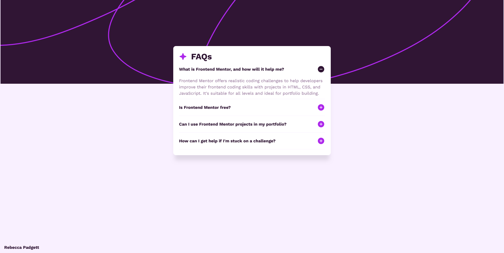

# Frontend Mentor - FAQ accordion solution

This is a solution to the [FAQ accordion challenge on Frontend Mentor](https://www.frontendmentor.io/challenges/faq-accordion-wyfFdeBwBz). Frontend Mentor challenges help you improve your coding skills by building realistic projects.

## Table of contents

- [Overview](#overview)
  - [The challenge](#the-challenge)
  - [Screenshot](#screenshot)
  - [Links](#links)
- [My process](#my-process)
  - [Built with](#built-with)
  - [What I learned](#what-i-learned)
  - [Useful resources](#useful-resources)
- [Author](#author)
- [Acknowledgments](#acknowledgments)

## Overview

### The challenge

Users should be able to:

- Hide/Show the answer to a question when the question is clicked
- Navigate the questions and hide/show answers using keyboard navigation alone
- View the optimal layout for the interface depending on their device's screen size
- See hover and focus states for all interactive elements on the page

### Screenshot



### Links

- Solution URL: [Frontend Mentor](https://www.frontendmentor.io/solutions/responsive-faq-accordion-using-html-css-and-js-znZAlxbxMF)
- Live Site URL: [Github Pages](https://bccpadge.github.io/faq-accordion-main/)

## My process

### Built with

<p align="left">
  
  
  
</p>

### What I learned

To switch the icons I used the JavaScript code below. I tried to used the `btn.insertAdjacientHTML("afterend", minusIcon)` but the minus icon would be outside the `button` completely. I decided to stick to `beforeend` instead and implemented this code below:

```css
[aria-expanded="true"] .add {
  display: none;
}

.minus {
  display: none;
}

[aria-expanded="true"] .minus {
  display: block;
}
```

```js
btn.insertAdjacentHTML("beforeend", plusIcon);
btn.insertAdjacentHTML("beforeend", minusIcon);
```

### Useful resources

- [WAI Accordion Example](https://www.w3.org/WAI/ARIA/apg/patterns/accordion/examples/accordion/) - I used this accordion pattern in this project.

## Author

<p align="left">
  <a href="https://www.frontendmentor.io/profile/bccpadge">
    
  </a>
  <a href="https://github.com/bccpadge">
    
 </a>
  <a href="https://www.linkedin.com/in/rebecca-padgett23">
    
  </a>
  <a href="https://t.snapchat.com/bNUplk4b">
    
  </a>
</p>

## Acknowledgments

- [YouTube Tutorial](https://www.youtube.com/watch?v=AxD9slgNDJI)
